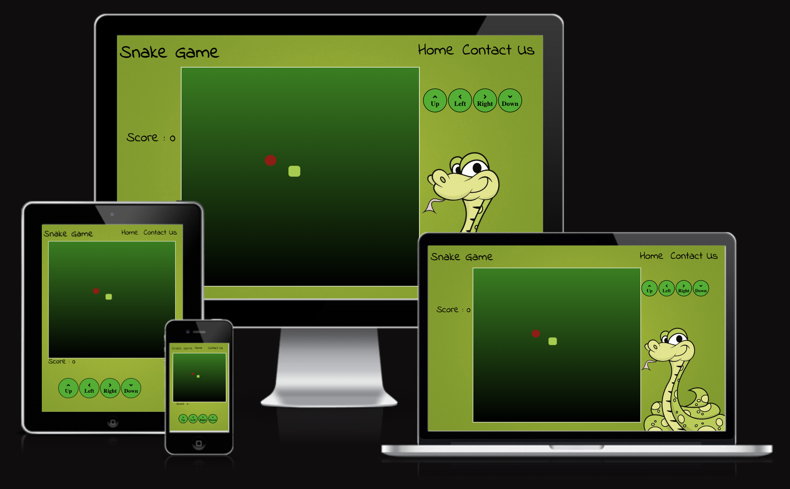
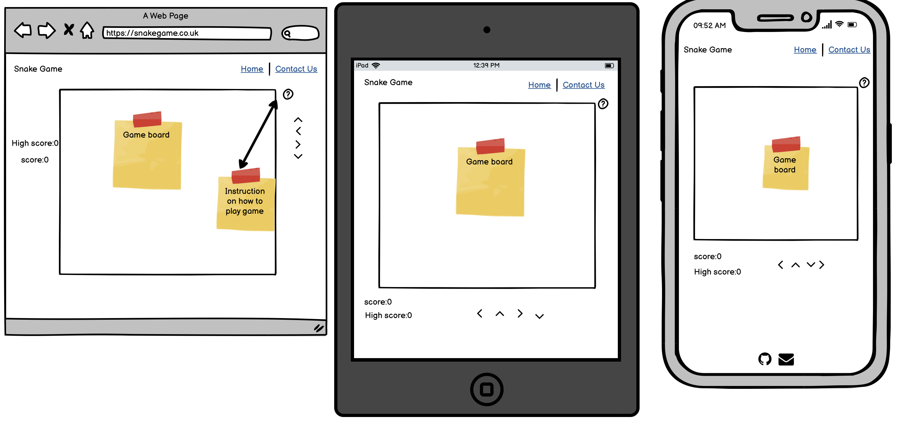
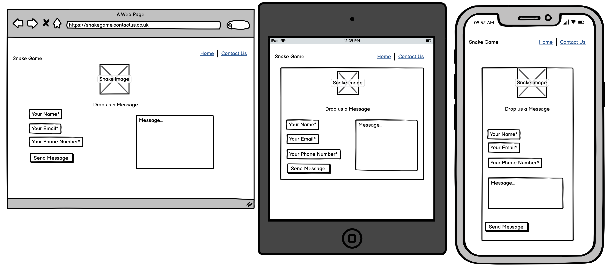
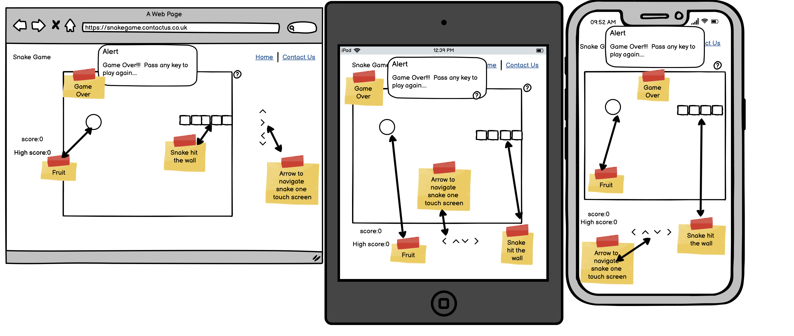
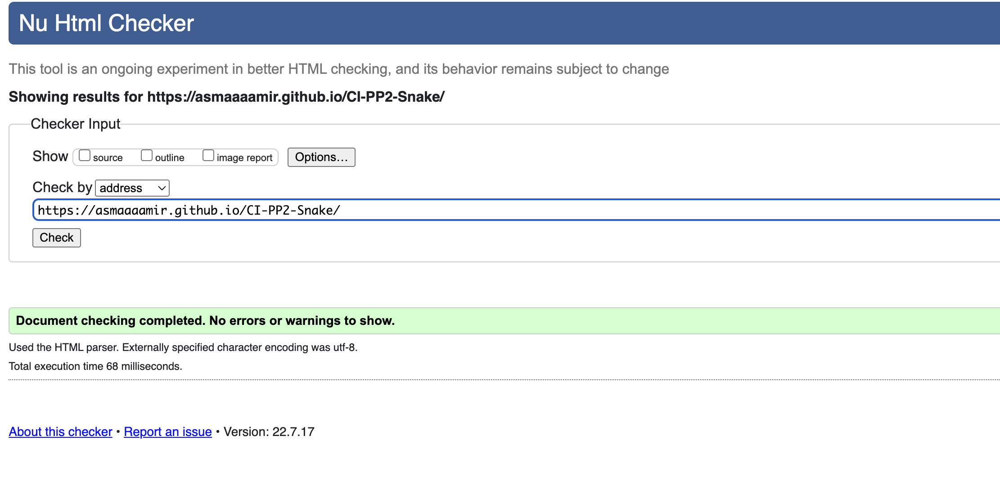
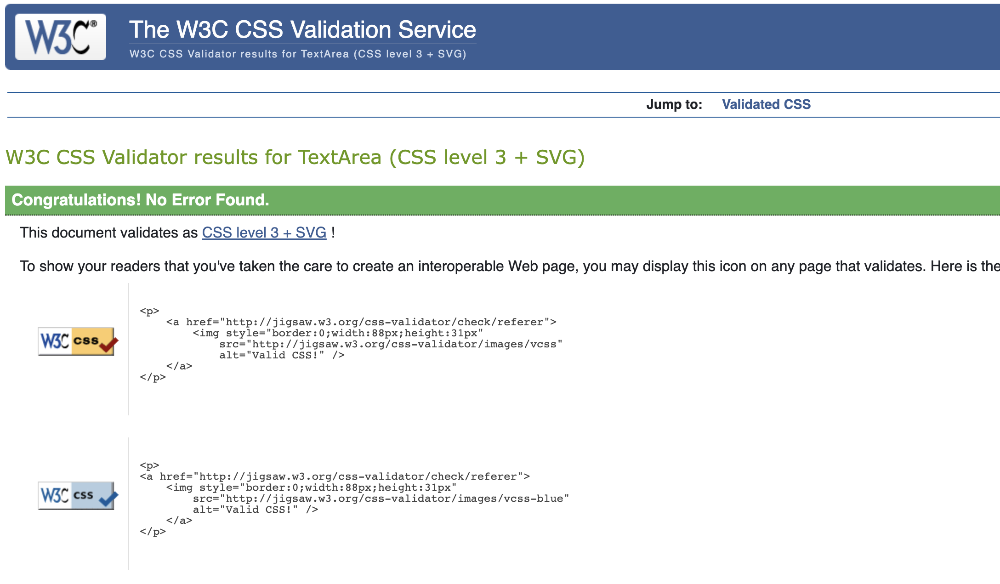

# CI-PP2-Snake
(Developer : Asma Aamir)

[Live Webpag](https://asmaaaamir.github.io/CI-PP2-Snake/) 

## Table of Content
1. [Project Goals](#projects-goals)
    1. [User Goals](#user-goals)
    2. [Site Owner Goals](#site-owner-goals)
2. [User Experience](#user-experiencer)
    1. [Target Audience](#target-audience)
    2. [User Requrements and Expectations](#users-requirment-and-expectations)
3. [Design](#design)
    1. [Design Choices](#design-choice)
    2. [Colour](#colour)
    3. [Fonts](#fonts)
    4. [Structure](#strucure)
    5. [Wireframes](#wireframes)
4. [Technologies Used](#technologies-used)
    1. [Languages](#languages)
    2. [Frameworks & Tools](#frameworks--tools)
5. [Features](#features)
6. [Testing](#validation)
    1. [HTML Validation](#html-validation)
    2. [CSS Validation](#css-validation)
    3. [Accessibility](#accessiblity)
    4. [Performance](#performance)
    5. [Device testing](#performing-tests-on-various-devices)
    6. [Browser compatibility](#browser-compatabilty)
    7. [Testing user stories](#test-users-stories)
8. [Bugs](#bugs)
9. [Deployment](#deployment)
10. [Credits](#credits)
11. [Acknowledgements](#acknowledgements)

## Projects Goals 

### User Goals"
* 
* 
*  

### Site Owner Goals:
* 
* 
* 

## User Experiencer

#### Target Audience
* 
* 
* 
* 

### Users Requirment and Expectations
* 
* 
* 

### User Stories 

### First-time User:
* 
* 
* 

### Returning User:
* 
* 
* 

## Design 

### Design choice
When design th game I kpt the original game in mind. 
### Colour
When choosing the colour scheme, I kept the simial colour as th original game. As I wanted to the remind the user what it was like to play the original game on the Nokia Mobile take thm back in time. 
### Fonts
When desciding on the font I wantd something that wouldnt take over the page, something that would be rlaxing the maing th baord bing the main foucse on th page. So I went for Indie Flower its relaxing and flowing. 
### Structure
The strucrture of the websit is simple, easy to navigate. It only consits of two page the home page that has the game baord and the contact us page alowing th user to gt in contact:
- Home Page : The home page has the navigation bar on th top right and game title on th right.I fth user were to click on the game name it will take thm to th home page. 
- Contact Us page: The contact us page  has a form that alows the user to get in contact with the devloper of the game. once the form is fill and Send Messag is clicked then user is alreated that the form has been send. 

### Wireframes

Home

Contact Us

Game Over

## Technologies Used 

### Languages 
* HTML 
* CSS
* Java Script 

### Frameworks & Tools
* GitHub 
* GitPod
* Balsamiq
* Google Font
* Google Images 
* Font Awsome
* Favicon.io 

## Features
The game has seven features, the Home page consists of six features and the Contact Us page has one : 

### Logo & Navigation Bar
The log and the Navigation Bar is located at the top of the page. The logo is on the left side of the page and when its clicked it takes the user back to home page. The navigation bar is located at the right hand side of the page, which has links to the home page and contact us page

### Game Board
The game board is loated at te center of the page making it the hightlight of the page. This where the snake and food is located Once the snake eats the food, the food move to its new location and the snake can be moved either with keybaord arrows or by using the arrows on screen. 

### Score 
The score is located on the left side of the page, It let the user know what their score is while they are playing the game.  

### High Score 
The high score is located on the left side of the page just below the score feature. It let the user knows what's the highest score on the game if so far, giving the user an challenge to beat the highest score.

### Direction Arrows 
These are located at the right handside of the gamebaord , user can use these to move the snake around the game board on a iPad or phone. These arrow can also be used on a PC or laptop.

### Contact Form
The Contact Us form is loacted in the center of the page, it allows the user to send feedback to the creater. 

## Validation 

#### HTML Validation
I used the W3C Markup Validation Service to validate the HTML of this website and all the pages pass with no errors and no warning were shown. 

Home

Contact Us

#### CSS Validation
I used the W3C Jigsaw CSS Validation Services to validate the Css of this websit and it all passed with oput any warring.

#### Jave Script Validation

#### Accessiblity 
#### Performance 

#### Performing tests on various device
* Mac
* iPhone 13 max
* ipad 

In addition, to above devises I have also tested using Google Chrome Developer Tool Device Toggeling option for the most populer devices that are currenty available on the market. 

#### Browser Compatabilty 
I have tested the website on few different browser such as:
* Google Chrome
* Safari 

### Test Users Stories

## Bugs 

## Deploment 
I followed the below steps to deploye this website using GitHub pages :

1. Go to GitHub repository navigation then setting
2. On the left hand side, you see Pages
3. Then on the middel of the page you see Source: there you will see branch and select Main
4. The select folder to be root and the save
5. It will take couple of mintues after refreshing your page you should see a light green ribbon on the top saying "Your site is published at https://asmaaaamir.github.io/CI-PP2-Snake/ .

## Credits 

### Code
The contact us form is from<a href="https://bootsnipp.com/snippets/7nmOW ">Bootstrap Snippet</a>. I did make few changes to fit with the game theme. 
The code for Email JS is from <a href="https://www.emailjs.com/docs/tutorial/creating-contact-form ">Email JS</a> website, I just added my public key,contact-service and contact-form to receive. 

### Media 
The images and sound that have ben used in the game are from:-
*  <a href="https://wallpapersafari.com/w/zldaLS">Background Image</a> 
*  <a href="https://www.pngwing.com/en/free-png-bpywu">Snake Image that has been used on contact us page</a>
* <a href="https://freesound.org/people/Koops/sounds/20279/">Snake eating food sound</a>

### Acknwldgements 
I would like to take this opportunit to thank :

My mentor Mo Shami for his feedback , advise and guidance
My mum Farida Liaqat for looking after my daughter and my daughter Zainab Rana for being very patient with me while I sit on computer all day.