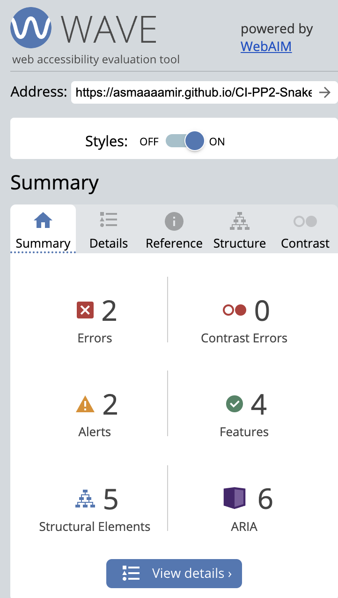
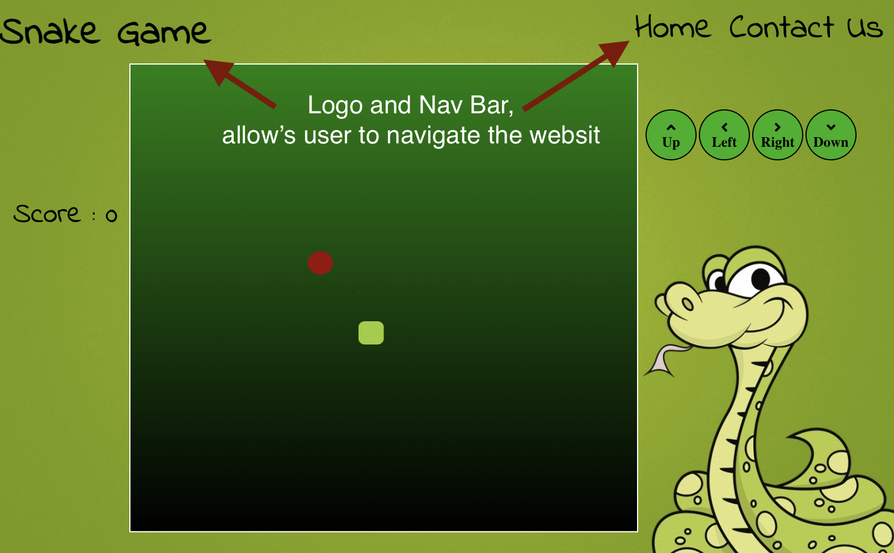
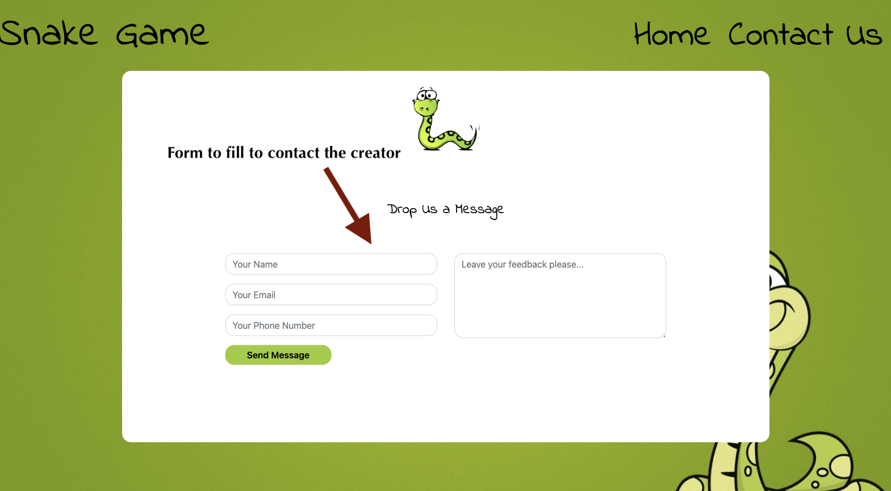

# CI-PP2-Snake
(Developer : Asma Aamir)

[Live Webpag](https://asmaaaamir.github.io/CI-PP2-SNAKE/) 

## Table of Content
1. [Project Goals](#projects-goals)
    1. [User Goals](#user-goals)
    2. [Site Owner Goals](#site-owner-goals)
2. [User Experience](#user-experiencer)
    1. [Target Audience](#target-audience)
    2. [User Requrements and Expectations](#users-requirment-and-expectations)
3. [Design](#design)
    1. [Design Choices](#design-choice)
    2. [Colour](#colour)
    3. [Fonts](#fonts)
    4. [Structure](#strucure)
    5. [Wireframes](#wireframes)
4. [Technologies Used](#technologies-used)
    1. [Languages](#languages)
    2. [Frameworks & Tools](#frameworks--tools)
5. [Features](#features)
6. [Testing](#validation)
    1. [HTML Validation](#html-validation)
    2. [CSS Validation](#css-validation)
    3. [Accessibility](#accessiblity)
    4. [Performance](#performance)
    5. [Device testing](#performing-tests-on-various-devices)
    6. [Browser compatibility](#browser-compatabilty)
    7. [Testing user stories](#test-users-stories)
8. [Bugs](#bugs)
9. [Deployment](#deployment)
10. [Credits](#credits)
11. [Acknowledgements](#acknowledgements)

## Projects Goals 

### User Goals

* A game that suitable for all different devices e.g. computer, laptop, mobile and tablet.
* Able to see what the results are while they are playing the game.
* Able to see the highest score of the game.

### Site Owner Goals:
* To creat a game that would be new and different but still reminder of the old game
* The game needs to be interactive and responsive on all deivces.
* The contact us form needs to be able to send feedback from the user to the creater. 

## User Experiencer

#### Target Audience
* Game enthusiasts
* User trying to challeng them self.

### Users Requirment and Expectations
* An a easy and simple to navigate the website. 
* Responsice too all devices.
* way to contact the site owner
* Engaging and interactive game to play 

### User Stories 

### First-time User:
* As a first time user, I want to be able to navigate the website quickly and easily. 
* As a first time user, I want to be able to know how can I contact the creater. 

### Returning User:
* As a returning user, I want to be able to send feed back to creater.

## Design 

### Design choice

I kept the orginal game in mind when creating the game because I wanted the users to experience some sense of familiarity and reminiscence with it. 

### Colour

I stuck with the same colour as the original game while creating the colour palette. I intended to transport the user back in time by reminding them of what it was like to play the original game on the Nokia Mobile.

### Fonts

When choosing the font, I was looking for something that wouldn't dominate the page and would allow the page's main focus to breathe. I choose Indie Flower because it is soothing and flowy.
### Structure
The website's structure is straightforward and simple to use. It just has two pages—the main page, which includes a gaming board, and the contact page, which enables users to get in touch:
- Home Page : On the upper right of the home page are the navigation buttons and the game title. A user will be directed to the main page if they click on the game's name.
- Contact Us page: The contact us page provides a form that enables users to contact the game's developer. After filling out the form and clicking Send Message, the user is informed that the form has been sent.

### Wireframes

Home

Contact Us

Game Over

## Technologies Used 

### Languages 
* HTML 
* CSS
* Java Script 

### Frameworks & Tools
* GitHub 
* GitPod
* Balsamiq
* Google Font
* Google Images 
* Font Awsome
* Favicon.io 

## Features
The Home page has four features, the Contact Us page has one, and the game itself has eight features.: 

### Logo & Navigation Bar
At the top of the page are the log and the navigation bar. When the logo, which is located on the left side of the page, is clicked, the user is returned to the homepage. The home page and the contact us page are linked in the navigation bar, which is on the right side of the page.

Screen Shot

### Game Board
The middle of the page is occupied by the game board, which serves as the page's focal point. This is where the snake and the food are. The snake can be moved using the arrows on the keyboard or the arrows on the screen once the food has been consumed by the snake. The food then moves to its new place.

Screen Shot

### Score 
While playing the game, the player can see their score by clicking on the score link on the left side of the page. 

Screen Shot

### Direction Arrows 
These can be used to move the snake around the game board on an iPad or phone; they are positioned on the right side of the gameboard. These arrows can be used on a computer or laptop as well.

Screen Shot

### Contact Form
The Contact Us form is located in the page's middle and enables users to contact the creator with feedback. 

Screen Shot

### Footer 
The footer contains 5 icons : 
- Feedback icon: that takes user to conatct us page
- Home icon: that takes the user to home page
- Facebook icon: takes user to facebook social page
- Instagram icon: takes user to thinstgram social page.
- Snapchat icon: takes user to snapchat social page.  

## Validation 

#### HTML Validation
The HTML of this website was validated using the W3C Markup Validation Service, and all of the pages passed without any errors or warnings being displayed.

Home

Contact Us

#### CSS Validation
I checked this website's CSS using the W3C Jigsaw CSS Validation Services, and everything passed without any issues.

Screen Shot

#### Jave Script Validation
I used JSHint to check the Java Script code for the game and the email submission form for contacting us.

Game

Contact Form

#### Accessiblity 

Home

Contact Us

#### Performance 

Home

Contact Us

#### Performing tests on various device
* Desktop - 1600 x 992 px
* Laptop - 1280 x 802 px
* Tablet - 768 x 1024 px
* Mobile - 320 x 480 px

In addition to the aforementioned devices, I also tried the Device Toggling option of the Google Chrome Developer Tool on the most common devices currently on the market.

#### Browser Compatabilty 
I have tested the website on few different browser such as:
* Google Chrome
* Safari 

### Test Users Stories
1. As a first time user, I want to be able to navigate the website quickly and easily :-

| Feature  | Action  | Expected Result  | Result |
|----------|---------|------------------|--------|
| The Logo and Nav Bar | When a user clicks on the home page or logo, the user is taken to the home screen. The user will be directed to the Contact Us page if they click Contact Us. | Easily and Quickly to use | Works as expected |

Story 1

2. As a first time user, I want to be able to know how can I contact the creater. 

|  Feature  |  Action  |  Expected Result  |  Result  |
|-----------|----------|-------------------|----------|
| The Contact Us Page | The user will be directed to the Contact Us page if they click Contact Us. | Gives the user the access to form to contact the user | Works as expected |

Story 2

3. As a returning user, I want to be able to send feed back to creater.

|  Feature  |  Action  |  Expected Result  |  Result  |
|-----------|----------|-------------------|----------|
| The Contact Us Page | If the user click's Contact Us it will take the user to Contact Us page | Gives the user the access to form where the user can fill the form | Works as expected |

Story 3

## Bugs 

*I received a warning while authenticating the Java Script, and I chatted with a tutor who advised me to disregard it. I've included this picture below.:

JS-warning

* The snake can therefore be manipulated on an iPad and a phone. I had to write a function in an HTML page and create a onclick event, which left some variables empty. 

Usused variables

## Deploment 
I followed the below steps to deploye this website using GitHub pages :

1. Go to GitHub repository navigation then setting
2. On the left hand side, you see Pages
3. Then on the middel of the page you see Source: there you will see branch and select Main
4. The select folder to be root and the save
5. It will take couple of mintues after refreshing your page you should see a light green ribbon on the top saying "Your site is published at https://asmaaaamir.github.io/CI-PP2-Snake/ .

## Credits 

### Code
The contact us form is from<a href="https://bootsnipp.com/snippets/7nmOW ">Bootstrap Snippet</a>. I did make few changes to fit with the game theme.  
The code for Email JS is from <a href="https://www.emailjs.com/docs/tutorial/creating-contact-form ">Email JS</a> website, I just added my public key,contact-service and contact-form to receive. 

### Media 
The images and sound that have ben used in the game are from:-
*  <a href="https://wallpapersafari.com/w/zldaLS">Background Image</a> 
*  <a href="https://www.pngwing.com/en/free-png-bpywu">Snake Image that has been used on contact us page</a>
* <a href="https://freesound.org/people/Koops/sounds/20279/">Snake eating food sound</a>

### Acknwldgements 
I would like to take this opportunit to thank you :
* My mentor Mo Shami for his feedback , advise and guidance
* My mum Farida Liaqat for looking after my daughter and my daughter Zainab Rana for being very patient with me.